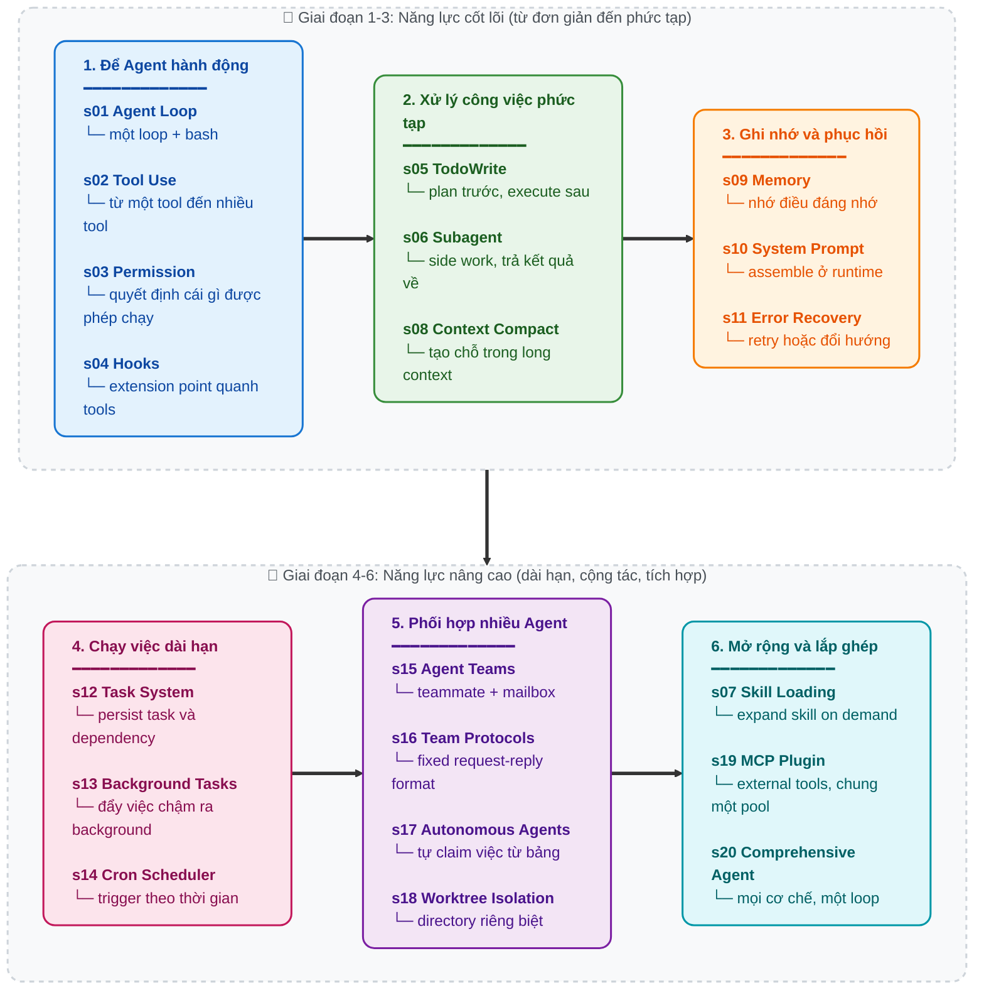

[English](./README.md) | [中文](./README-zh.md) | [日本語](./README-ja.md) | [Tiếng Việt](./README.vn.md)

<a href="https://trendshift.io/repositories/19746" target="_blank"></a>

# Learn Claude Code -- Kỹ thuật Harness cho Agent thực thụ

## Agency đến từ Model. Một sản phẩm Agent = Model + Harness.

Trước khi viết bất kỳ dòng code nào, cần làm rõ một điều:

**Agency -- khả năng nhận thức, suy luận và hành động -- đến từ quá trình huấn luyện model, không phải từ lớp orchestration bên ngoài.** Nhưng để tạo ra một sản phẩm agent thực sự chạy được, bạn cần cả model lẫn harness. Model là người lái. Harness là chiếc xe. Repository này dạy bạn cách làm ra chiếc xe đó.

### Agency đến từ đâu

Ở trung tâm của mọi agent là một neural network -- có thể là Transformer, RNN, hay bất kỳ hàm đã được huấn luyện nào -- được định hình bởi hàng tỷ lần cập nhật gradient trên các chuỗi perception, reasoning và action. Agency không phải thứ được “gắn thêm” bằng code bên ngoài. Nó được học trong quá trình training.

Con người là ví dụ nguyên bản nhất. Một neural network sinh học, được mài giũa qua hàng triệu năm tiến hóa, nhận thức thế giới bằng giác quan, suy nghĩ bằng bộ não và hành động bằng cơ thể. Khi DeepMind, OpenAI hay Anthropic nói về “agent”, họ đều đang nói đến cùng một ý cốt lõi: **một model đã học được cách hành động thông qua huấn luyện, cộng với hạ tầng giúp nó vận hành trong một môi trường cụ thể.**

Lịch sử cho thấy điều đó rất rõ:

- **2013 -- DeepMind DQN chơi Atari.** Một neural network duy nhất, chỉ nhận raw pixels và điểm số game, đã học được 7 game Atari 2600 -- vượt qua các thuật toán trước đó và đánh bại chuyên gia con người ở 3 game. Đến năm 2015, hệ thống được mở rộng lên [49 game ở mức professional tester](https://www.nature.com/articles/nature14236), công bố trên *Nature*. Không có luật riêng cho từng game. Một model, học từ trải nghiệm.

- **2019 -- OpenAI Five chinh phục Dota 2.** Năm neural network đã chơi [45.000 năm Dota 2 với chính mình](https://openai.com/index/openai-five-defeats-dota-2-world-champions/) trong 10 tháng, rồi đánh bại **OG** -- nhà vô địch TI8 -- 2-0 trong trận trực tiếp. Trong public arena, AI thắng 99,4% trong 42.729 trận. Không có scripted strategy. Các model học teamwork thông qua self-play.

- **2019 -- DeepMind AlphaStar làm chủ StarCraft II.** AlphaStar [đánh bại một tuyển thủ chuyên nghiệp 10-1](https://deepmind.google/blog/alphastar-mastering-the-real-time-strategy-game-starcraft-ii/) trong các trận kín, sau đó đạt [Grandmaster rank](https://www.nature.com/articles/d41586-019-03298-6) trên máy chủ châu Âu -- top 0,15% trong số 90.000 người chơi. Đây là game thời gian thực, thông tin không đầy đủ, với action space lớn hơn rất nhiều so với cờ vua hay cờ vây.

- **2019 -- Tencent Jueyu thống trị Honor of Kings.** Hệ thống “Jueyu” của Tencent AI Lab [đánh bại các tuyển thủ KPL trong chế độ full 5v5](https://www.jiemian.com/article/3371171.html) tại bán kết World Champion Cup. Ở chế độ 1v1, tuyển thủ chuyên nghiệp [chỉ thắng 1 trong 15 trận, và trận tốt nhất cũng kéo dài chưa tới 8 phút](https://developer.aliyun.com/article/851058). Cường độ training: một ngày tương đương 440 năm chơi của con người. Model học toàn bộ game từ đầu bằng self-play.

- **2024-2025 -- LLM agents đang thay đổi kỹ thuật phần mềm.** Claude, GPT, Gemini -- các large language model được huấn luyện trên kho tàng code và reasoning của con người -- được triển khai như coding agents. Chúng đọc codebase, viết implementation, debug lỗi, và phối hợp như một team. Kiến trúc vẫn giống hệt các agent trước đó: một model đã được huấn luyện, đặt vào một environment, và được cấp tools cho perception lẫn action.

Mỗi cột mốc đều chỉ về cùng một sự thật: **Agency -- khả năng perceive, reason và act -- là thứ được huấn luyện, không phải được viết tay.** Nhưng mỗi agent cũng cần một môi trường để hoạt động: trình giả lập Atari, Dota 2 client, StarCraft II engine, hay một IDE kèm terminal. Model cung cấp intelligence. Environment cung cấp action space. Kết hợp lại, chúng tạo thành một agent hoàn chỉnh.

### Agent KHÔNG phải là gì

Từ “agent” đã bị cả một ngành prompt-plumbing chiếm dụng.

Các drag-and-drop workflow builder. Các nền tảng “AI Agent” no-code. Các thư viện orchestration cho prompt chain. Tất cả đều dựa trên cùng một ảo tưởng: rằng chỉ cần nối các LLM API call bằng if-else, node graph và hardcoded routing logic là đã “xây dựng agent”.

Không phải vậy. Thứ họ tạo ra là những cỗ máy Rube Goldberg -- phức tạp quá mức, mong manh, đầy pipeline thủ tục -- với một LLM bị nhét vào như một text-completion node được thổi phồng. Đó không phải agent. Đó là shell script khoác áo hào nhoáng.

Bạn không thể brute-force intelligence bằng cách chồng chất procedural logic -- rule tree, node graph, prompt waterfall -- rồi hy vọng đống glue code đó sẽ tự nhiên sinh ra hành vi tự chủ. Điều đó không xảy ra. Agency không thể được “lắp ráp” bằng tay. Agency là thứ phải được học.

### Cú chuyển tư duy: từ “xây agent” sang xây Harness

Khi ai đó nói “Tôi đang xây một agent”, thực ra họ chỉ có thể đang nói về một trong hai việc:

**1. Huấn luyện model.** Điều chỉnh trọng số bằng reinforcement learning, fine-tuning, RLHF hoặc các phương pháp dựa trên gradient khác. Thu thập trajectory data -- các chuỗi perception, reasoning và action trong thế giới thực -- rồi dùng chúng để định hình hành vi của model. Đây là công việc của DeepMind, OpenAI, Tencent AI Lab và Anthropic.

**2. Xây dựng harness.** Viết code để cung cấp cho model một môi trường vận hành. Đây mới là việc của phần lớn chúng ta, và cũng là trọng tâm của repository này.

Harness là toàn bộ những gì một agent cần để làm việc trong một domain cụ thể:

```
Harness = Tools + Knowledge + Observation + Action Interfaces + Permissions

    Tools:          file I/O, shell, network, database, browser
    Knowledge:      product docs, domain references, API specs, style guides
    Observation:    git diff, error logs, browser state, sensor data
    Action:         CLI commands, API calls, UI interactions
    Permissions:    sandbox isolation, approval workflows, trust boundaries
```

Model quyết định. Harness thực thi. Model suy luận. Harness cung cấp ngữ cảnh. Model là người lái. Harness là chiếc xe.

Repository này dạy bạn cách làm chiếc xe cho coding. Nhưng các design pattern ở đây hoàn toàn có thể mở rộng sang những domain khác.

### Harness engineer thực sự làm gì

Nếu bạn đang đọc repository này, rất có thể bạn là một harness engineer. Công việc thực sự bao gồm:

- **Implement tools.** Trao cho agent đôi tay. Đọc/ghi file, thực thi shell, gọi API, điều khiển browser, truy vấn database. Mỗi tool là một action mà agent có thể thực hiện trong environment của nó. Tool cần được thiết kế theo kiểu atomic, composable và mô tả rõ ràng.

- **Curate knowledge.** Trao cho agent kiến thức chuyên ngành. Product docs, architecture decision records, style guide, compliance requirement. Chỉ tải khi cần, không nhồi tất cả ngay từ đầu.

- **Manage context.** Trao cho agent một bộ nhớ sạch. Subagent isolation ngăn nhiễu loạn lan sang task khác. Context compaction ngăn lịch sử đè bẹp hiện tại. Task system giúp mục tiêu tồn tại qua nhiều lượt hội thoại.

- **Control permissions.** Trao cho agent ranh giới. Sandbox file access. Yêu cầu approval cho thao tác phá hủy. Thực thi trust boundary giữa agent và hệ thống bên ngoài.

- **Collect trajectory data.** Mỗi chuỗi action mà agent thực hiện trong harness của bạn đều là training signal. Những trajectory thu được từ deployment thực tế là nguyên liệu thô để fine-tune thế hệ agent tiếp theo.

Bạn không viết ra intelligence. Bạn đang xây thế giới mà intelligence có thể sống và làm việc trong đó. Chất lượng của thế giới ấy quyết định trực tiếp việc intelligence có thể phát huy được đến mức nào.

**Hãy xây harness thật tốt. Phần còn lại, model sẽ lo.**

### Vì sao là Claude Code

Vì Claude Code là implementation về agent harness thanh lịch và hoàn chỉnh nhất mà chúng tôi từng thấy. Không phải nhờ mẹo vặt nào, mà chính vì những gì nó *không* làm: nó không cố gắng trở thành agent. Nó không áp đặt workflow cứng nhắc. Nó không thay phán đoán của model bằng decision tree viết tay. Nó chỉ cung cấp tools, knowledge, context management và permission boundaries -- rồi lùi lại đúng chỗ.

Nếu lột Claude Code về phần cốt lõi, bạn sẽ thấy:

```
Claude Code = một agent loop
            + tools (bash, read, write, edit, glob, grep, browser...)
            + on-demand skill loading
            + context compaction
            + subagent spawning
            + task system with dependency graphs
            + async mailbox team coordination
            + worktree-isolated parallel execution
            + permission governance
            + hooks extension system
            + memory persistence
            + MCP external capability routing
```

Hết. Agent tự thân là ai? Claude. Một model. Được Anthropic huấn luyện trên toàn bộ kho tri thức reasoning và code của con người. Harness không làm Claude thông minh. Claude vốn đã thông minh. Harness chỉ trao cho Claude tay, mắt và workspace.

Điều quan trọng không phải là “hãy sao chép Claude Code”. Điều quan trọng là: **những sản phẩm agent tốt nhất luôn đến từ các kỹ sư hiểu rằng việc của họ là xây harness, không phải giả vờ viết ra intelligence.**

---

```
                    THE AGENT PATTERN
                    =================

    User --> messages[] --> LLM --> response
                                      |
                            stop_reason == "tool_use"?
                           /                          \
                         yes                           no
                          |                             |
                    execute tools                    return text
                    append results
                    loop back -----------------> messages[]


    Model quyết định khi nào gọi tool và khi nào dừng.
    Code chỉ thực thi những gì model yêu cầu.
    Repo này dạy bạn xây mọi thứ xoay quanh loop đó --
    tức là phần harness giúp agent hiệu quả trong một domain cụ thể.
```

## Core Pattern

```python
def agent_loop(messages):
    while True:
        response = client.messages.create(
            model=MODEL, system=SYSTEM,
            messages=messages, tools=TOOLS,
        )
        messages.append({"role": "assistant",
                         "content": response.content})

        if response.stop_reason != "tool_use":
            return

        results = []
        for block in response.content:
            if block.type == "tool_use":
                output = TOOL_HANDLERS[block.name](**block.input)
                results.append({
                    "type": "tool_result",
                    "tool_use_id": block.id,
                    "content": output,
                })
        messages.append({"role": "user", "content": results})
```

Mỗi lesson trong repo này chỉ đơn giản là đặt thêm một harness mechanism lên trên loop đó -- còn chính loop thì không thay đổi. Loop thuộc về agent. Mechanism thuộc về harness.

Loop là hằng số. Tools, knowledge và permissions mới là thứ thay đổi. Agent = Model (LLM) + một operational environment đủ tổng quát (Harness).

---

## Tình trạng phiên bản

Repository này hiện có hai tutorial track:

- **Track hiện tại: các thư mục `s01-s20` ở root**
  `s01_*` đến `s20_*` là canonical version mới. Mỗi chapter có narrative README đầy đủ, bản dịch, `code.py` có thể chạy được và diagram nếu cần.

- **Track chuyển tiếp cũ: `docs/`, `agents/`, và `web/` hiện tại**
  Chúng vẫn giữ phiên bản 12-bài cũ để phục vụ người đọc hiện tại, các link cũ và nền tảng web trong thời gian track 20-bài mới dần ổn định.

Nếu bạn bắt đầu từ bây giờ, hãy đọc các chapter root-level từ [s01_agent_loop/](s01_agent_loop/) đến [s20_comprehensive/](s20_comprehensive/). Nếu bạn đi theo một link cũ hoặc đang dùng web app hiện tại, nhiều khả năng bạn đang ở track 12-bài legacy. Số chapter giữa hai track không phải lúc nào cũng khớp, vì vậy đừng trộn số chương giữa chúng.

### Bảng ánh xạ từ track cũ sang track mới

| Track 12-bài cũ | Track 20-bài mới | Chủ đề |
|---|---|---|
| old s01 | new s01 | Agent Loop |
| old s02 | new s02 | Tool Use |
| old s03 | new s05 | TodoWrite |
| old s04 | new s06 | Subagent |
| old s05 | new s07 | Skill Loading |
| old s06 | new s08 | Context Compact |
| old s07 | new s12 | Task System |
| old s08 | new s13 | Background Tasks |
| old s09 | new s15 | Agent Teams |
| old s10 | new s16 | Team Protocols |
| old s11 | new s17 | Autonomous Agents |
| old s12 | new s18 | Worktree Isolation |
| chỉ có ở track mới | s03, s04, s09, s10, s11, s14, s19, s20 | Permission, Hooks, Memory, System Prompt, Error Recovery, Cron, MCP, Comprehensive Agent |

---

## Scope

Đây là một dự án học về harness engineering theo kiểu 0-to-1: mục tiêu là dạy bạn cách xây môi trường làm việc xung quanh một agent model. Để đường học rõ ràng, một số production mechanism được cố ý đơn giản hóa hoặc lược bỏ:

- Hành vi đầy đủ của event / hook bus, như `PreToolUse`, `SessionStart/End`, `ConfigChange`.
  Code giảng dạy chỉ dùng những lifecycle event tối thiểu khi thật sự cần.
- Rule-based permission governance và trust workflow hoàn chỉnh.
- Session lifecycle control như resume/fork, cũng như worktree lifecycle handling đầy đủ hơn.
- Chi tiết runtime của MCP như transport, OAuth, resource subscription và polling.

Giao thức JSONL mailbox trong repo này chỉ là teaching implementation, không phải tuyên bố rằng đây là đúng với một production internal implementation cụ thể nào.

---

## 20 bài học tiến dần từng bước

**Mỗi bài thêm đúng một harness mechanism. Mỗi mechanism có một khẩu hiệu riêng.**

> **s01** &nbsp; *"Một loop và Bash là đủ để bắt đầu"* &mdash; một tool + một loop = một agent
>
> **s02** &nbsp; *"Thêm một tool tức là thêm một handler"* &mdash; loop giữ nguyên; tool mới chỉ cần đăng ký vào dispatch map
>
> **s03** &nbsp; *"Đặt ranh giới trước rồi mới trao tự do"* &mdash; xác định cái gì được chạy, cái gì phải chặn, cái gì cần approval
>
> **s04** &nbsp; *"Hook bọc quanh loop, đừng viết lại loop"* &mdash; thêm extension point mà không phá loop chính
>
> **s05** &nbsp; *"Agent không có plan sẽ trôi dạt"* &mdash; liệt kê các bước trước khi bắt đầu; completion rate tăng mạnh
>
> **s06** &nbsp; *"Big task phải tách nhỏ, mỗi subtask cần clean context"* &mdash; subagent làm phần việc phụ và chỉ mang kết quả quay lại
>
> **s07** &nbsp; *"Knowledge chỉ nên load khi cần"* &mdash; liệt kê skill trước, chỉ mở rộng khi thật sự dùng đến
>
> **s08** &nbsp; *"Context sớm muộn cũng đầy -- hãy có cách tạo chỗ"* &mdash; multi-layer compaction giúp session có thể kéo dài vô hạn
>
> **s09** &nbsp; *"Nhớ thứ quan trọng, quên thứ không cần"* &mdash; ba subsystem: selection, extraction, consolidation
>
> **s10** &nbsp; *"Prompt được lắp ở runtime, không hardcode"* &mdash; ghép theo từng section, load theo nhu cầu
>
> **s11** &nbsp; *"Error không phải điểm cuối, mà là điểm bắt đầu của retry"* &mdash; retry, nhường chỗ, hoặc đổi hướng khi mọi thứ thất bại
>
> **s12** &nbsp; *"Big goal phải tách thành small task, có thứ tự, có persistence"* &mdash; file-backed task graph đặt nền cho multi-agent coordination
>
> **s13** &nbsp; *"Slow operation thì đưa ra background, agent tiếp tục suy nghĩ"* &mdash; background thread chạy command; khi xong thì inject notification
>
> **s14** &nbsp; *"Đến giờ thì tự chạy, không cần người nhắc"* &mdash; trigger task tự động theo thời gian
>
> **s15** &nbsp; *"Một agent không đủ thì giao việc cho teammate"* &mdash; teammate sống lâu + async mailbox
>
> **s16** &nbsp; *"Teammate cần cùng một luật giao tiếp"* &mdash; dùng fixed request-reply format để phối hợp
>
> **s17** &nbsp; *"Teammate tự nhìn bảng, tự nhận việc"* &mdash; không cần leader gán từng việc một; hệ thống tự tổ chức
>
> **s18** &nbsp; *"Mỗi người làm trong directory riêng, không giẫm chân nhau"* &mdash; task gắn với goal, worktree gắn với directory, liên kết bằng ID
>
> **s19** &nbsp; *"Thiếu capability thì cắm thêm qua MCP"* &mdash; nối external tool vào cùng một tool pool
>
> **s20** &nbsp; *"Nhiều mechanism, nhưng vẫn là một loop"* &mdash; mọi cơ chế trước đó hợp lại thành một harness hoàn chỉnh

---

## Lộ trình học

Mạch chính của repo là: hành động → xử lý việc phức tạp → ghi nhớ và phục hồi → chạy việc dài hơi → cộng tác → mở rộng và lắp ghép.



---

## Tất cả các chapter

| Chapter | Topic | Key Concepts |
|---|---|---|
| [s01](./s01_agent_loop/) | Agent Loop | `messages` / `while True` / `stop_reason` |
| [s02](./s02_tool_use/) | Tool Use | `TOOL_HANDLERS` / dispatch map / concurrency |
| [s03](./s03_permission/) | Permission System | `PermissionRule` / approval pipeline |
| [s04](./s04_hooks/) | Hook System | `PreToolUse` / `PostToolUse` / extension points |
| [s05](./s05_todo_write/) | TodoWrite | `TodoItem` / plan-then-execute |
| [s06](./s06_subagent/) | Subagent | `fresh messages[]` / context isolation |
| [s07](./s07_skill_loading/) | Skill Loading | `SkillManifest` / on-demand injection |
| [s08](./s08_context_compact/) | Context Compact | snipCompact / microCompact / toolResultBudget / autoCompact |
| [s09](./s09_memory/) | Memory System | selection / extraction / consolidation |
| [s10](./s10_system_prompt/) | System Prompt | runtime assembly / section concatenation |
| [s11](./s11_error_recovery/) | Error Recovery | token escalation / fallback model / retry strategies |
| [s12](./s12_task_system/) | Task System | `TaskRecord` / `blockedBy` / disk persistence |
| [s13](./s13_background_tasks/) | Background Tasks | threaded execution / notification queue |
| [s14](./s14_cron_scheduler/) | Cron Scheduler | durable scheduling / session-scoped triggers |
| [s15](./s15_agent_teams/) | Agent Teams | `MessageBus` / inbox / permission bubbling |
| [s16](./s16_team_protocols/) | Team Protocols | shutdown handshake / plan approval |
| [s17](./s17_autonomous_agents/) | Autonomous Agents | idle cycle / auto-claim / self-organization |
| [s18](./s18_worktree_isolation/) | Worktree Isolation | `WorktreeRecord` / task-directory binding |
| [s19](./s19_mcp_plugin/) | MCP Plugin | multi-transport / channel routing / tool pool assembly |
| [s20](./s20_comprehensive/) | Comprehensive Agent | all mechanisms around one loop |

---

## Cách đọc

Mỗi chapter là một folder. Mở ra bạn sẽ thấy:

```
s08_context_compact/
  README.md              # full narrative với inline code
  README.en.md           # English translation
  README.ja.md           # Japanese translation
  code.py                # standalone runnable implementation
  images/                # SVG diagrams (khi cần)
```

Hãy đọc `README.md` để nắm core idea rồi đi cùng code. Các chapter phức tạp có phần `<details>` để đào sâu hơn -- khi nào muốn tìm hiểu kỹ hơn thì mở ra. Chapter đơn giản có 0-1 diagram, chapter phức tạp sẽ có nhiều hơn.

Nên đọc từ s01 đến s20 theo đúng thứ tự. Mỗi chapter đều giả định bạn đã đi qua những chapter trước, và kết thúc bằng một đường dẫn sang chapter tiếp theo.

---

## Bắt đầu nhanh

### Track 20-bài hiện tại

```sh
git clone https://github.com/shareAI-lab/learn-claude-code
cd learn-claude-code
pip install -r requirements.txt
cp .env.example .env   # cấu hình ANTHROPIC_API_KEY

python s01_agent_loop/code.py        # Bắt đầu từ đây -- một loop + bash
python s08_context_compact/code.py   # Context compaction (phức tạp)
python s20_comprehensive/code.py     # Đích cuối: mọi cơ chế trong một loop
```

### Track 12-bài legacy

```sh
python agents/s01_agent_loop.py
python agents/s12_worktree_task_isolation.py
python agents/s_full.py
```

### Web Platform

Web app hiện tại vẫn render track legacy `docs/` s01-s12. Nếu bạn muốn theo track mới, hãy dùng các folder ở root.

```sh
cd web && npm install && npm run dev   # http://localhost:3000
```

---

## Cấu trúc dự án

```
learn-claude-code/
  s01_agent_loop/          # một folder cho mỗi chapter
    README.md              #   nguồn tiếng Trung (complete narrative)
    README.en.md           #   bản dịch tiếng Anh
    README.ja.md           #   bản dịch tiếng Nhật
    code.py                #   standalone runnable code
    images/                #   SVG diagrams
  s02_tool_use/
  ...
  s19_mcp_plugin/
  s20_comprehensive/       # endpoint chapter
  agents/                  # legacy 12 runnable copies + s_full.py
  skills/                  # skill files dùng ở s07
  docs/                    # tài liệu 12-bài legacy, giữ trong giai đoạn chuyển tiếp
  web/                     # hiện tại render track legacy docs/
  tests/
```

---

## Bước tiếp theo là gì

Sau 20 lesson, bạn sẽ hiểu harness engineering từ bên trong ra ngoài. Từ đó có hai con đường để biến kiến thức thành sản phẩm:

### Kode Agent CLI -- Open-Source Coding Agent CLI

> `npm i -g @shareai-lab/kode`

Có support cho Skill và LSP, tương thích Windows, chạy được với GLM / MiniMax / DeepSeek và các open model khác. Cài xong là dùng.

GitHub: **[shareAI-lab/Kode-Agent](https://github.com/shareAI-lab/Kode-Agent)**

### Kode Agent SDK -- Nhúng Agent capability vào ứng dụng của bạn

Một thư viện độc lập, không tạo overhead tiến trình cho từng user. Có thể embed vào backend, browser extension, embedded device hoặc bất kỳ runtime nào.

GitHub: **[shareAI-lab/kode-agent-sdk](https://github.com/shareAI-lab/kode-agent-sdk)**

---

## Tutorial chị em: từ passive session đến always-on assistant

Harness trong repo này thuộc kiểu **use-and-discard** -- mở terminal, giao task cho agent, xong thì đóng, và phiên sau lại bắt đầu từ đầu. Claude Code hoạt động theo cách đó.

Nhưng [OpenClaw](https://github.com/openclaw/openclaw) cho thấy một khả năng khác: trên cùng một agent core, chỉ cần thêm hai harness mechanism là agent có thể chuyển từ kiểu “chạm mới chạy” sang kiểu “cứ 30 giây tự tỉnh dậy để xem có việc không”:

- **Heartbeat** -- cứ mỗi 30 giây, harness gửi cho agent một message để nó kiểm tra pending work. Không có gì? Ngủ tiếp. Có việc mới? Làm ngay.
- **Cron** -- agent có thể tự schedule future task cho chính nó, và chúng sẽ tự fire khi đến thời điểm.

Khi thêm IM multi-channel routing (WhatsApp / Telegram / Slack / Discord và hơn 13 nền tảng khác), persistent context memory, cùng Soul personality system, agent sẽ chuyển từ disposable tool thành một always-on personal AI assistant thực thụ.

**[claw0](https://github.com/shareAI-lab/claw0)** là repository tutorial chị em của dự án này, bóc tách các harness mechanism đó từ đầu:

```
claw agent = agent core + heartbeat + cron + IM chat + memory + soul
```

```
learn-claude-code                   claw0
(agent harness internals:            (always-on harness:
 loop, tools, planning,               heartbeat, cron, IM channels,
 teams, worktree isolation)            memory, Soul personality)
```

## License

MIT

---

**Agency đến từ model. Harness trao cho agency một nơi để hạ cánh. Hãy xây harness cho tốt, phần còn lại model sẽ làm.**

**Bash is all you need. Real agents are all the universe needs.**

**Đây không phải “copy source code”. Đây là “nắm được các thiết kế cốt lõi và tự tay xây lại”.**